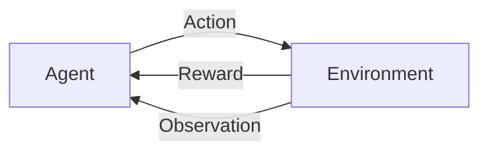

# Gymnasium – Custom Environment Notes

## 1. Core Functions You Must Implement

When creating a custom environment (by inheriting from `gym.Env`), you must implement:

### 1️⃣ `reset()`

**Purpose:**
- Resets the environment to its initial internal state.
- Called at the beginning of every episode.

**Used when:**
- Episode terminates
- Training restarts

**Returns:**
- `observation`
- `info` (optional dictionary)

---

### 2️⃣ `step(action)`

**Purpose:**
- Executes one action in the environment.

**Input:**
- `action`

**Must return:**
- `observation`
- `reward`
- `terminated`
- `truncated`
- `info`

**Components:**

- **observation** → New state after action  
- **reward** → Scalar feedback signal  
- **terminated** → `True` if episode naturally ends  
  - Example: all passengers seated  
- **truncated** → `True` if episode is forcefully stopped  
  - Example: time limit reached (MountainCar max steps)  
- **info** → Extra debugging/training data (dictionary)

---

### 3️⃣ `render()`

**Purpose:**
- Handles visualization.
- Can display graphics or print statements.

---

## 2. Required Class Attributes

### `metadata`
- Expected by Gymnasium.
- Defines:
  - Available render modes
  - Render speed (FPS)

### `action_space`
- Defines what actions the agent can take.
- Example:
  ```python
  Discrete(n)