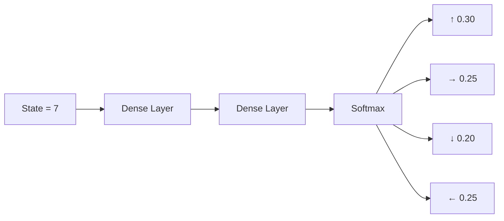

# PPO – Actor Network (Policy Model)

---

## Environment (3x3 Grid)

States numbered:

1 | 2 | 3  
4 | 5 | 6  
7 | 8 | 9  

- Agent is currently in **State 7**
- Cookie (reward) is in **State 9**
- Hole (penalty) is in **State 8**

---

## Actor Network / Policy Model

### Input:
State = 7

### Output:
Probability distribution over actions

| Action | Probability |
|--------|------------|
| ↑ (Up)    | 0.30 |
| → (Right) | 0.25 |
| ↓ (Down)  | 0.20 |
| ← (Left)  | 0.25 |
| **Total** | **1.00** |

---

## Step 1

1. Feed state (7) into Actor Network
2. Network outputs action probabilities
3. Sample action from distribution
4. Execute action in environment

---

## Key Idea

PPO does **not** predict Q-values.  
It predicts:

π(a | s) → Probability of taking action `a` given state `s`

---

