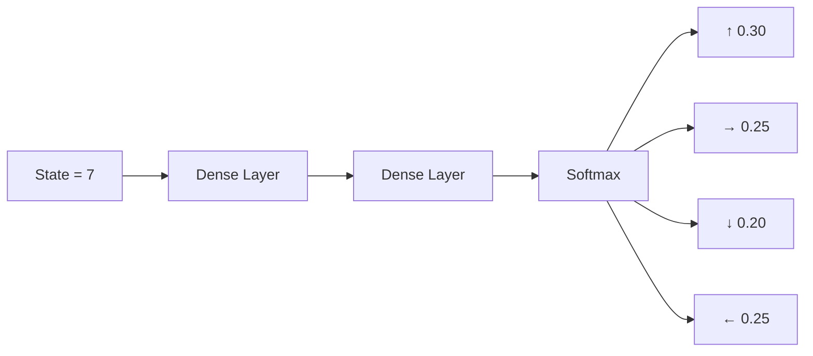
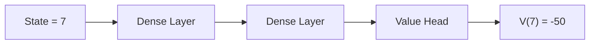
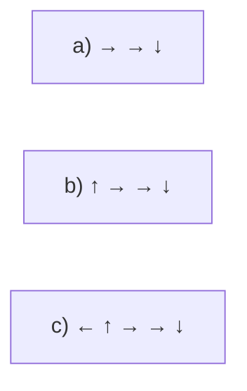

# PPO – Actor Network (Policy Model)

---

## Environment (3x3 Grid)

States numbered:

1 | 2 | 3  
4 | 5 | 6  
7 | 8 | 9  

- Agent is currently in **State 7**
- Cookie (reward) is in **State 9**
- Hole (penalty) is in **State 8**

---

## Actor Network / Policy Model

### Input:
State = 7

### Output:
Probability distribution over actions

| Action | Probability |
|--------|------------|
| ↑ (Up)    | 0.30 |
| → (Right) | 0.25 |
| ↓ (Down)  | 0.20 |
| ← (Left)  | 0.25 |
| **Total** | **1.00** |

---

## Step 1

1. Feed state (7) into Actor Network
2. Network outputs action probabilities
3. Sample action from distribution
4. Execute action in environment

---

## Key Idea

PPO does **not** predict Q-values.  
It predicts:

π(a | s) → Probability of taking action `a` given state `s`

---

---

## Critic Network / Value Model

### Input:
State = 7

### Output:
State value estimate (how good this state is)

\[
V(s)
\]

Example:
- \(V(7) = -50\)

---

## Step 2

1. Feed state (7) into Critic Network
2. Network outputs a single value \(V(7)\)
3. This value is used to compute **advantage** later (actor update)

---

## Key Idea

Critic predicts **state value**, not action probabilities:

---

## Step 3 — Collect a Batch of Trajectories

We sample multiple rollouts using the current policy.

### Example Trajectories

Each rollout starts from state 7 and follows sampled actions.

---

## Stored Data Per Step

For each timestep, we store:

(state, action, log π(a|s), reward, value)

---

## Example Batch Entries

a)

(7, →, log(0.25), -100, -50)

b)

(7, ↑, log(0.25), -1, -50)

c)

(7, ←, log(0.25), -1, -50)

---

## What Each Term Means

- **state** → input to actor & critic  
- **action** → sampled action  
- **log π(a|s)** → log probability from actor  
- **reward** → environment feedback  
- **value** → critic prediction V(s)

---

## Step 4 — Calculate Rewards-to-Go

We compute the discounted return for each trajectory:

Rt = Rt + γRt+1 + γ²Rt+2 + γ³Rt+3 + ...

Where:
- γ = discount factor (example: 0.9)
- Rt = immediate reward at time t

---

### Example Calculations

#### a)

Rtga = -100

(Falls into hole immediately)

---

#### b)

Rtgb = -1 + 0.9(-1) + 0.9²(-1) + 0.9³(-1)

= -1 - 0.9 - 0.81 - 0.729  
= **-3.4**

---

#### c)

Rtgc = -1 + 0.9(-1) + 0.9²(-1) + 0.9³(-1) + 0.9⁴(-1)

= -1 - 0.9 - 0.81 - 0.729 - 0.6561  
= **-4.1**

---

## What This Means

- We convert raw rewards into **discounted cumulative returns**
- These returns are used to compute:
  - Advantage
  - Policy loss
  - Value loss

---

### Why Use a Discount Factor (γ)?

The discount factor ensures that:

1. **Recent rewards matter more** than distant future rewards.
2. The total return remains **bounded**, even for very long episodes.
3. Training remains **numerically stable** for neural networks.

Example:

If reward = -1 at every step and γ = 0.9:

Return = -1 - 0.9 - 0.9² - 0.9³ - ...

This is a geometric series:

Return = -1 / (1 - 0.9) = -10

So even if the episode lasts forever, the return does not explode.

---

**Key Insight:**  
Discounting both prioritizes short-term impact and prevents very large return magnitudes.

---

## Step 5 — Calculate Advantage

Advantage measures how much better an action is compared to the average value of the state.

A(s, a) = Q(s, a) − V(s)

Here:
- Q(s, a) ≈ Rewards-to-Go
- V(s) = Critic prediction

---

### Using Our Values

We had:

V(7) = -50  

Rewards-to-Go:

a) →  -100  
b) ↑  -3.4  
c) ←  -4.1  

---

### Advantage Calculations

a)

A(7, →) = -100 − (-50) = **-50**

b)

A(7, ↑) = -3.4 − (-50) = **46.6**

c)

A(7, ←) = -4.1 − (-50) = **45.9**

---

### What This Means

- Negative advantage → bad action  
- Positive advantage → good action  
- Bigger positive number → better action  

The actor will increase probability of actions with **positive advantage**  
and decrease probability of actions with **negative advantage**.

--
---

## Step 6 — Optimize Critic Network

The critic tries to match its prediction V(s) to the true return (Rewards-to-Go).

We use Mean Squared Error (MSE) loss:

Loss = (1 / n) Σ (RTG_i − V_i)²

Where:
- RTG_i = Rewards-to-Go (target)
- V_i = Critic prediction
- n = number of samples in batch

---

### Using Our Example

V(7) = -50  

RTG values:
- -100
- -3.4
- -4.1

Loss = average of:

(-100 − (-50))²  
(-3.4 − (-50))²  
(-4.1 − (-50))²  

---

### What Happens During Training

- If prediction is too low → it increases  
- If prediction is too high → it decreases  
- The critic moves toward the average true return

After training:
V(7) should move closer to around -3.4 (the best trajectory)

---

### Key Idea

The critic is learning:

V(s) ≈ Expected future reward from state s

---

## Step 7 — Optimize Actor Network (PPO Clip Objective)

Goal: update action probabilities using Advantage.

We compute the probability ratio:

r = (current action probability) / (old action probability)

If:
- Advantage > 0 → increase probability
- Advantage < 0 → decrease probability

But we limit how much it can change.

We clip r inside:

0.8 ≤ r ≤ 1.2   (if ε = 0.2)

Final objective:

min( r * A , clip(r, 0.8, 1.2) * A )

This prevents large policy jumps.

---

### Intuition

- Small improvements are allowed.
- Large aggressive updates are blocked.
- Keeps training stable.

---

## Step 8 — Repeat Actor & Critic Updates

Using the same batch:

1. Update Critic (minimize MSE loss)
2. Update Actor (maximize PPO objective)

Repeat this for N epochs (hyperparameter).

This slowly improves both networks.

---

## Step 9 — Collect New Batch and Repeat

After updating:

1. Use new actor to collect new trajectories.
2. Compute Rewards-to-Go.
3. Compute Advantage.
4. Update Critic.
5. Update Actor.
6. Repeat until total time steps reached.

Training stops when we reach predefined time steps (e.g., 100k, 1M).

---

### Final Result

- Actor learns better action probabilities.
- Critic learns accurate value estimates.
- Policy converges toward optimal behavior.